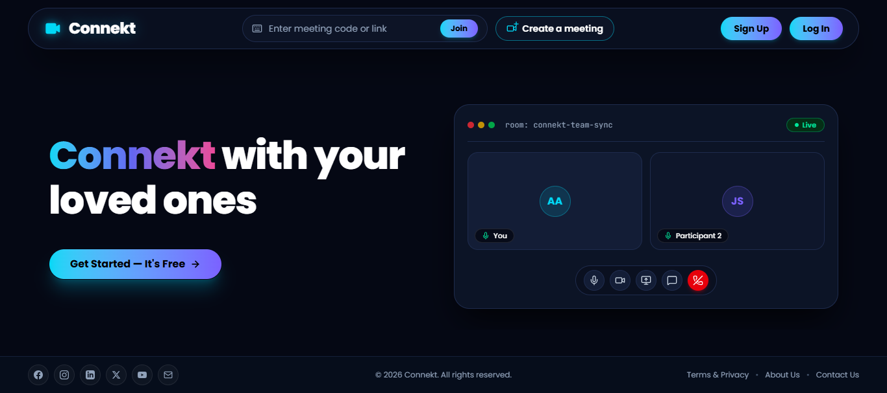
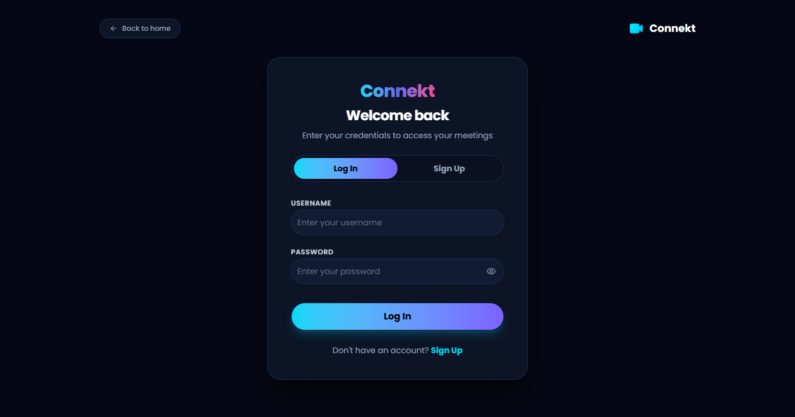
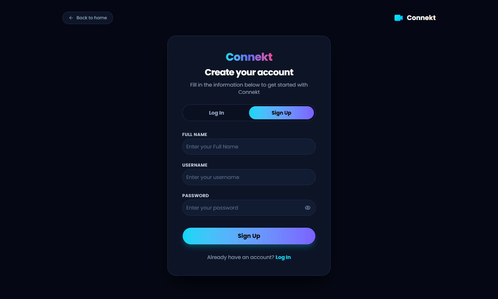
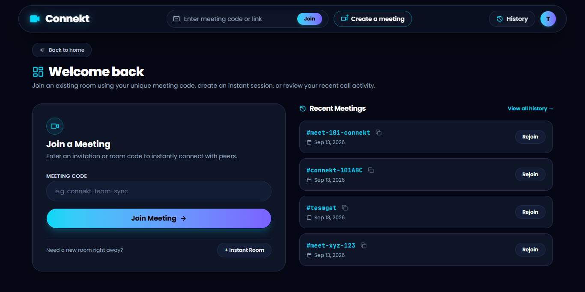
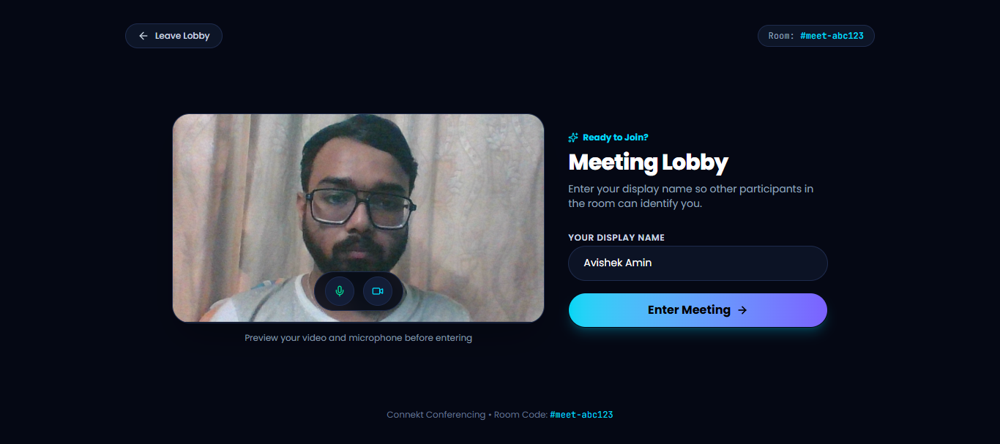
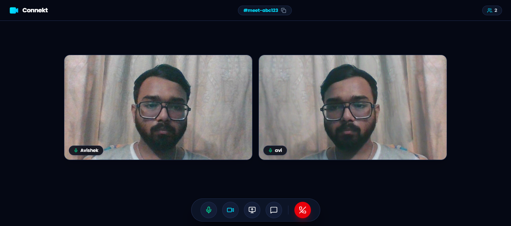
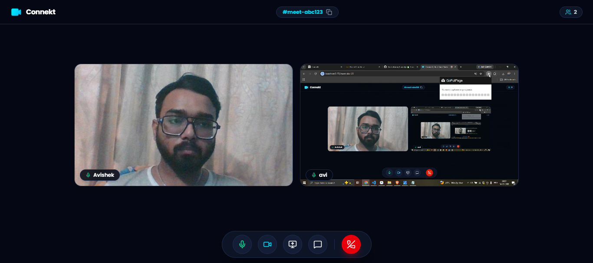
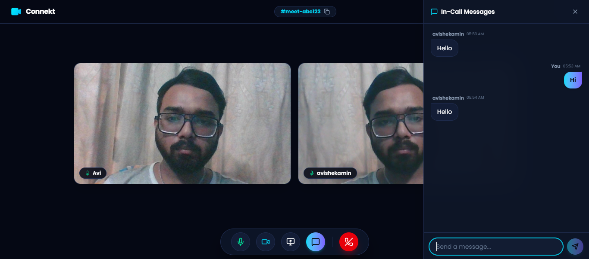
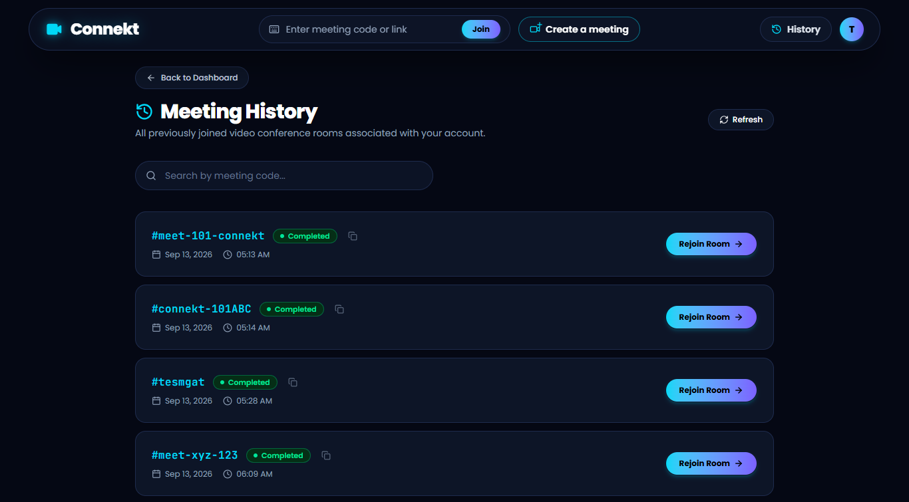

# 🎥 Connekt: Real-Time Video Conferencing Platform

[](https://react.dev/)
[](https://vite.dev/)
[](https://nodejs.org/)
[](https://expressjs.com/)
[](https://webrtc.org/)
[](https://socket.io/)
[](https://www.mongodb.com/atlas)
[](https://tailwindcss.com/)
[](https://www.docker.com/)
[](LICENSE)

**Connekt** is an enterprise-grade, full-stack real-time video conferencing platform built with modern WebRTC, Socket.IO, React 19, Express 5, and MongoDB Atlas. Engineered for ultra-low latency peer-to-peer media communication, robust session security, and a sleek, futuristic dark cyberpunk aesthetic with neon accents.

Connekt delivers seamless multi-peer video meetings, crystal-clear audio with real-time level metering, zero-renegotiation screen sharing, synchronized in-meeting chat, meeting history persistence, and comprehensive authentication with refresh token reuse detection.

---

## 🌐 Live Deployment

- 🔗 **Production Web App:** [https://connekt-avishek.onrender.com](https://connekt-avishek.onrender.com)
- 🔗 **Production Backend API:** [https://connekt-avishek-backend.onrender.com](https://connekt-avishek-backend.onrender.com)

> ⚠️ **Note on Render Free Tier:** The backend is hosted on Render's free compute tier, which automatically spins down when idle. The initial request or login after inactivity may take 20–30 seconds while the container spins up. Subsequent requests run at full speed.

---

## 🎯 Architectural Pillars

1. **Modern Unified-Plan WebRTC**: Multi-peer mesh using standard transceivers (`addTrack`/`ontrack`), smooth track replacement for instant screen sharing (`sender.replaceTrack()`), and real-time audio energy level metering via the Web Audio API.
2. **Hardened Dual-Token Security**: Short-lived (15m) JWT access tokens combined with secure, `httpOnly`, `sameSite: strict` refresh tokens featuring session family rotation and automatic replay attack revocation.
3. **Isolated Real-Time Signaling**: Socket.IO handshake authenticated via JWT, strict single-room enforcement per socket, cross-room signal injection prevention, and sliding-window chat rate limiting.
4. **Resilient Layered API**: Express 5.x layered architecture (Routes → Middleware → Controllers → Services → Models) with Zod schema validation, Helmet security headers, and automated rate limiting.

---

## 🏗️ System Architecture

Connekt separates RESTful state management and identity verification from real-time WebRTC signaling and peer-to-peer media streaming.

### High-Level Topology

```text
                                  ┌─────────────────────────────────────────┐
                                  │            Client (Browser)             │
                                  │                                         │
                                  │  React 19 + Vite + TailwindCSS v4       │
                                  │  - AuthContext (Bootstrap & Tokens)     │
                                  │  - Axios Interceptors (Silent Refresh)  │
                                  │  - WebRTC Peer Connection Manager       │
                                  │  - Web Audio API (AnalyserNode)         │
                                  └─────────────┬───────────────────────────┘
                                                │
                       ┌────────────────────────┴────────────────────────┐
                       │ REST APIs (HTTPS)                               │ Socket.IO Signaling (WSS)
                       ▼                                                 ▼
        ┌─────────────────────────────┐                   ┌───────────────────────────────┐
        │     Express 5.x Backend     │                   │       Socket.IO Gateway       │
        │                             │                   │                               │
        │  - Helmet Security Headers  │                   │  - Handshake JWT Verification │
        │  - Global / Auth Rate Limit │                   │  - Single-Room Enforcement    │
        │  - Zod Request Validation   │                   │  - Cross-Room Signal Firewall │
        │  - Cookie Parser (HttpOnly) │                   │  - Sliding Window Chat Limit  │
        └──────────────┬──────────────┘                   └───────────────┬───────────────┘
                       │                                                  │
                       ▼                                                  ▼
        ┌─────────────────────────────┐                   ┌────────────────────────────────────┐
        │        Service Layer        │                   │     WebRTC Mesh Topology           │
        │                             │                   │                                    │
        │  - authService (JWT/Family) │                   │  Peer A ◄─── P2P Media ───► Peer B │
        │  - historyService (MongoDB) │                   │    ▲                         ▲     │
        └──────────────┬──────────────┘                   │    └──────── Peer C ─────────┘     │
                       │                                  │   (Google STUN: stun.l.google.com) │
                       ▼                                  └────────────────────────────────────┘
        ┌─────────────────────────────┐
        │        MongoDB Atlas        │
        │                             │
        │  - Users & Refresh Sessions │
        │  - User Meeting Activities  │
        └─────────────────────────────┘
```

### Detailed Component Interaction

```text
+---------------------------------------------------------------------------------------------------+
| FRONTEND CLIENT (React 19 / Vite)                                                                 |
|                                                                                                   |
|  +--------------------+   +-----------------------+   +-------------------+   +----------------+  |
|  | AuthContext        |   | Axios API Client      |   | Socket Client     |   | WebRTC Manager |  |
|  | State & User Auth  |-->| Bearer Auth Header    |-->| Handshake with    |-->| RTCPeerConnect |  |
|  | Session Lifecycle  |   | 401 Silent Token Rot. |   | Active JWT Token  |   | Unified Plan   |  |
|  +--------------------+   +-----------------------+   +-------------------+   +----------------+  |
+---------------------------------------|-------------------------|-----------------------|---------+
                                        |                         |                       |
                             HTTPS REST |              WSS Events |                       |
                                        v                         v                       |
+-----------------------------------------------------------------+                       |
| BACKEND SERVER (Node.js / Express 5 / Socket.IO)                |                       |
|                                                                 |                       |
|  [Middleware Pipeline]                                          |                       |
|  Helmet -> CORS -> RateLimiter -> CookieParser -> JsonParser    |                       |
|                                                                 |                       |
|  [REST Routes & Controllers]       [Socket.IO Manager]          |                       |
|  - /api/v1/auth/*                  - Connection Auth Gate       |                       |
|  - /api/v1/meetings/*              - room:join / peer:joined    |                       |
|  - /health                         - signal:offer/answer/ice    |                       |
|                                    - chat:message Rate Limiter  |                       |
|  [Services & Data Layer]                                        |                       |
|  - authService.js (Bcrypt + JWT + Session Family Tree)          |                       |
|  - historyService.js (Atomic Mongoose Queries)                  |                       |
+---------------------------------------|-------------------------+                       |
                                        |                                                 |
                       Database Queries |                                     STUN / ICE  |
                                        v                                                 v
+-----------------------------------------------+             +-------------------------------------+
| MONGODB ATLAS CLUSTER                         |             | GOOGLE STUN INFRASTRUCTURE          |
| - Users Collection (Bcrypt Passwords, Tokens) |             | stun:stun.l.google.com:19302        |
| - Meetings Collection (User History Activity) |             | NAT Traversal & Candidate Discovery |
+-----------------------------------------------+             +-------------------------------------+
```

---

## 🔄 Real-Time Signaling & WebRTC Lifecycle

```text
Peer A (Host)                      Socket.IO Server                      Peer B (Joiner)
      │                                   │                                      │
      │── 1. room:join { roomId } ───────>│                                      │
      │<─ 2. room:joined { roomId } ──────│                                      │
      │                                   │                                      │
      │                                   │<── 3. room:join { roomId } ──────────│
      │                                   │─── 4. room:joined { roomId, peers }─>│
      │<─ 5. peer:joined { peerId: B } ───│                                      │
      │                                   │                                      │
      │── 6. signal:offer ───────────────>│ (Verify same-room co-location)       │
      │                                   │─── 7. signal:offer ─────────────────>│
      │                                   │                                      │
      │                                   │<── 8. signal:answer ─────────────────│
      │<─ 9. signal:answer ───────────────│                                      │
      │                                   │                                      │
      │── 10. signal:ice-candidate ──────>│─── 11. signal:ice-candidate ────────>│
      │<─ 13. signal:ice-candidate ───────│<── 12. signal:ice-candidate ─────────│
      │                                   │                                      │
      │================== 14. Direct P2P Media Stream Established ===============│
      │                                   │                                      │
      │── 15. media:state-change ────────>│─── 16. media:state-change ──────────>│
      │── 17. chat:message ──────────────>│─── 18. chat:message ────────────────>│
      │                                   │                                      │
      │                                   │<── 19. disconnect ───────────────────│
      │<─ 20. peer:left { peerId: B } ────│                                      │
```

---

## ✨ Feature Deep-Dive

### 🔐 1. Authentication & Session Security
- **Dual-Token System**:
  - **Access Token**: Stateless JWT (15-minute expiration) sent in `Authorization: Bearer <token>` header.
  - **Refresh Token**: Cryptographically secure UUID token (7-day expiration) stored exclusively in an `httpOnly`, `sameSite: strict`, `secure` cookie to prevent XSS exfiltration.
- **Refresh Token Rotation & Reuse Detection**:
  - Every refresh token exchange generates a new token while preserving the lineage (`sessionId`, `revokedAt`, `replacedBySessionId`).
  - If a revoked token is replayed (indicating a compromised token), the backend immediately revokes the **entire session family**, protecting the account against hijack attempts.
- **Brute Force Protection**: Dedicated rate limiter restricts authentication attempts to 20 requests per 15 minutes per IP.
- **Input Validation**: All payloads validated using strict Zod schemas before reaching the service layer.

### 🎥 2. Modern WebRTC Real-Time Audio & Video
- **Unified-Plan RTCPeerConnection**: Audio and video tracks are managed via standard transceivers (`sendrecv`), fully compliant with modern browser standards.
- **Zero-Renegotiation Screen Sharing**: When a user initiates or terminates screen sharing, `sender.replaceTrack()` swaps the video track directly on existing peer connections. This eliminates screen flickering and connection drops.
- **Active Audio Level Metering**: Integrated `AudioContext` and `AnalyserNode` measure microphone RMS energy, providing real-time visual indicators when a participant speaks.
- **Track Lifecycle Management**: All microphone and webcam tracks are explicitly stopped upon leaving a call, preventing lingering device activity indicators in the browser.

### ⚡ 3. Hardened Socket.IO Signaling
- **Handshake Authentication**: Socket.IO connections require a valid JWT passed in `auth.token`. Unauthenticated or expired socket connections are rejected at handshake.
- **Single-Room Enforcement**: A client socket can only belong to one room at any time. Joining a new room automatically detaches and notifies peers in the previous room.
- **Cross-Room Signal Firewall**: The server verifies that both the sender and the recipient socket are in the exact same room before routing `signal:offer`, `signal:answer`, or `signal:ice-candidate`.
- **Chat Validation & Rate Limiting**: Chat messages are restricted to 1,000 characters and rate-limited via a sliding window (maximum 5 messages every 5 seconds) to prevent spam. Sender identity is stamped directly from the authenticated session.

### 🎨 4. Futuristic Cyberpunk UI & Responsiveness
- **Aesthetic**: Deep space-grade dark theme (`#050814`) with cyan (`#00d8f6`) and violet (`#7b61ff`) glow accents.
- **Responsive Layouts**: Dynamic CSS Grid meeting video layout that automatically shifts between 1-to-1 spotlight views and multi-peer gallery tiles.
- **Dedicated Chat Drawer**: In-meeting real-time chat with unread message badges and sender attribution.
- **Meeting Lobby & Controls**: Pre-join device previews, one-click camera/microphone toggling, screen sharing controls, and end-meeting redirection to Dashboard.
- **Informational Pages**: Dedicated Privacy & Terms, About Us, and Contact Us pages styled uniformly.

---

## 📷 Screenshots

### 1. Landing Page


### 2. User Authentication (Login)


### 3. New Account Registration (Signup)


### 4. User Dashboard & Meeting Launchpad


### 5. Pre-Meeting Lobby & Device Preview


### 6. Real-Time Multi-Peer Video Conference


### 7. Instant Screen Sharing


### 8. In-Meeting Real-Time Chat


### 9. Meeting History & Activity Logs


---

## 🚀 Tech Stack

### Frontend Architecture
- **Framework:** [React 19](https://react.dev/) + [Vite 8](https://vite.dev/) (Client Environment)
- **Routing:** [React Router 7](https://reactrouter.com/) (Protected Routes & Auth-aware redirects)
- **Styling:** [Tailwind CSS v4](https://tailwindcss.com/) + [Shadcn UI](https://ui.shadcn.com/)
- **Component Primitives:** [Radix UI](https://www.radix-ui.com/) (`@radix-ui/react-slot`)
- **Iconography:** [Lucide React](https://lucide.dev/)
- **HTTP Client:** [Axios](https://axios-http.com/) (With request interceptor for Bearer JWT & response interceptor for silent token refresh queue)
- **Real-Time Client:** [Socket.IO Client](https://socket.io/docs/v4/client-api/)
- **Audio Processing:** Web Audio API (`AudioContext` + `AnalyserNode` for microphone volume level metering)
- **Utilities:** `clsx`, `tailwind-merge`, `class-variance-authority`, `cn`

### Backend Architecture
- **Runtime:** [Node.js](https://nodejs.org/) (ES Modules)
- **Framework:** [Express.js 5](https://expressjs.com/)
- **Real-Time Engine:** [Socket.IO 4.8](https://socket.io/) (Scoped room signaling & real-time messaging)
- **Database ODM:** [Mongoose 9.9](https://mongoosejs.com/) (MongoDB connection pooling & schema models)
- **Authentication:** [jsonwebtoken](https://github.com/auth0/node-jsonwebtoken) (Stateless access tokens) + [bcrypt](https://github.com/kelektiv/node.bcrypt.js) (Salted password hashing)
- **Validation:** [Zod 4](https://zod.dev/) (Runtime schema enforcement)
- **Security Middleware:** [Helmet](https://helmetjs.github.io/), [express-rate-limit](https://github.com/express-rate-limit/express-rate-limit), [cookie-parser](https://github.com/expressjs/cookie-parser), [cors](https://github.com/expressjs/cors)
- **Automated Testing:** Node Native Test Runner (`node --test`), [Supertest](https://github.com/ladjs/supertest)

### Real-Time & Cloud Infrastructure
- **Media Protocol:** Modern WebRTC Unified Plan (`RTCPeerConnection`, `addTrack`, `ontrack`, `replaceTrack`)
- **NAT Traversal:** Google Public STUN (`stun:stun.l.google.com:19302`)
- **Database Cluster:** [MongoDB Atlas](https://www.mongodb.com/atlas)
- **Deployment Platform:** [Render](https://render.com/)

---

## 📁 Project Structure

```text
connekt/
│
├── .github/
│   └── workflows/
│       └── ci.yml                      # GitHub Actions CI workflow (tests, lint, docker buildx)
│
├── backend/
│   ├── src/
│   │   ├── config/
│   │   │   ├── database.js             # MongoDB connection setup
│   │   │   └── env.js                  # Environment configuration & validation
│   │   ├── controllers/
│   │   │   ├── auth.controller.js      # Auth request handlers (login, signup, refresh, logout)
│   │   │   └── user.controller.js      # Meeting history & user activity handlers
│   │   ├── middleware/
│   │   │   ├── asyncHandler.js         # Async error wrapper
│   │   │   ├── auth.js                 # JWT Bearer authentication guard
│   │   │   ├── errorHandler.js         # Centralized error handler
│   │   │   ├── rateLimiter.js          # Auth and global rate limiters
│   │   │   └── validate.js             # Zod schema validation middleware
│   │   ├── models/
│   │   │   ├── meeting.model.js        # Meeting activity schema
│   │   │   ├── session.model.js        # Refresh token session family schema
│   │   │   └── user.model.js           # User credentials schema
│   │   ├── routes/
│   │   │   ├── auth.routes.js          # Authentication endpoints (/api/v1/auth)
│   │   │   ├── health.routes.js        # Health check endpoint (/health)
│   │   │   └── users.routes.js         # Meeting history & backward compat routes
│   │   ├── services/
│   │   │   ├── authService.js          # Auth business logic, token rotation & reuse detection
│   │   │   └── historyService.js       # Meeting history business logic
│   │   ├── sockets/
│   │   │   ├── chatHandler.js          # Real-time chat & rate-limited message handling
│   │   │   ├── roomManager.js          # Scoped room membership & presence tracking
│   │   │   ├── signalingHandler.js     # WebRTC SDP offer, answer & ICE candidate relay
│   │   │   ├── socketAuth.js           # Socket handshake JWT verification
│   │   │   └── socketManager.js        # Main Socket.IO connection dispatcher
│   │   ├── utils/
│   │   │   └── AppError.js             # Custom operational error class
│   │   ├── validators/
│   │   │   └── auth.validator.js       # Zod schemas for credentials & registration
│   │   └── app.js                      # Express application & HTTP server bootstrap
│   ├── test/
│   │   ├── auth.test.js                # Auth, token rotation & reuse detection tests
│   │   └── socket.test.js              # Socket handshake, room isolation & chat tests
│   ├── .dockerignore                   # Docker build ignore patterns
│   ├── .env.example                    # Backend environment template
│   ├── Dockerfile                      # Production Node 20 Alpine container image
│   ├── package.json
│   └── package-lock.json
│
├── frontend/
│   ├── public/
│   │   └── favicon.svg                 # Application favicon
│   ├── src/
│   │   ├── components/
│   │   │   ├── layout/
│   │   │   │   └── Navbar.jsx          # Header navigation bar with user profile
│   │   │   ├── meeting/
│   │   │   │   ├── ChatPanel.jsx       # In-meeting real-time chat drawer
│   │   │   │   ├── MeetingControls.jsx # Audio, video, screen share & end-call buttons
│   │   │   │   ├── MeetingHeader.jsx   # Meeting code display & meeting timer
│   │   │   │   ├── MeetingLobby.jsx    # Pre-meeting device check & preview lobby
│   │   │   │   ├── VideoGrid.jsx       # Adaptive multi-peer video grid layout
│   │   │   │   └── VideoTile.jsx       # Individual participant video & status tile
│   │   │   └── ui/
│   │   │       ├── badge.jsx           # Shadcn badge primitive
│   │   │       ├── button.jsx          # Shadcn button primitive
│   │   │       ├── input.jsx           # Shadcn input primitive
│   │   │       └── skeleton.jsx        # Loading skeleton primitive
│   │   ├── config/
│   │   │   └── environment.js          # Dynamic environment & backend URL selector
│   │   ├── constants/
│   │   │   └── routes.js               # Application route path constants
│   │   ├── contexts/
│   │   │   └── AuthContext.jsx         # Global authentication state provider
│   │   ├── hooks/
│   │   │   ├── useAuth.js              # Hook for authentication operations
│   │   │   ├── useMediaStream.js       # Hook for camera & microphone stream management
│   │   │   ├── useMeetingHistory.js    # Hook for fetching meeting activity history
│   │   │   ├── useMeetingSocket.js     # Hook for Socket.IO signaling lifecycle
│   │   │   └── useWebRTC.js            # Hook for peer connections & screen sharing
│   │   ├── pages/
│   │   │   ├── about.jsx               # About Us information page
│   │   │   ├── authentication.jsx      # Login and registration page
│   │   │   ├── contact.jsx             # Contact Us page
│   │   │   ├── dashboard.jsx           # User dashboard for starting/joining calls
│   │   │   ├── history.jsx             # Past meeting history page
│   │   │   ├── landing.jsx             # Landing page with hero & footer
│   │   │   ├── privacy.jsx             # Terms & Privacy policy page
│   │   │   └── videoMeet.jsx           # Real-time WebRTC conferencing page
│   │   ├── services/
│   │   │   ├── api.js                  # Axios client with silent token refresh interceptor
│   │   │   ├── authService.js          # Auth API request methods
│   │   │   └── historyService.js       # Meeting history API request methods
│   │   ├── utils/
│   │   │   ├── formatters.js           # Date and text formatting utilities
│   │   │   └── withAuth.jsx            # Protected route Higher-Order Component
│   │   ├── App.jsx                     # Application routing & route tree
│   │   ├── index.css                   # Global styles & theme custom properties
│   │   └── main.jsx                    # React application entry point
│   ├── .dockerignore                   # Docker build ignore patterns
│   ├── components.json                 # Shadcn UI configuration
│   ├── Dockerfile                      # Multi-stage build (Node 20 builder -> Nginx runner)
│   ├── eslint.config.js                # ESLint configuration
│   ├── index.html                      # HTML entry template
│   ├── jsconfig.json                   # Path alias mappings (@/*)
│   ├── nginx.conf                      # SPA routing, security headers & health probe
│   ├── package.json
│   ├── package-lock.json
│   └── vite.config.js                  # Vite bundler configuration
│
├── screenshots/                        # Production UI screenshot assets
│   ├── chat.png
│   ├── dashboard.png
│   ├── history.png
│   ├── landing.png
│   ├── login.png
│   ├── meeting_lobby.png
│   ├── screen_sharing.png
│   ├── signup.png
│   └── video_conference.png
│
├── .env.docker.example                 # Docker Compose environment variable template
├── .gitignore
├── docker-compose.yml                  # Local orchestration (MongoDB, backend, frontend)
├── LICENSE                             # ISC Open-Source License
└── README.md
```

---

## 📡 Complete API Reference

All protected REST endpoints require an active Bearer JWT in the `Authorization: Bearer <accessToken>` header. Session rotation and termination utilize the secure `refreshToken` HttpOnly cookie. Real-time signaling and in-meeting communications require an authenticated JWT during the Socket.IO handshake (`auth: { token }`).

### Health & Observability

| Method | Endpoint  | Description                        | Auth   | Request Body | Response                                                  |
| :----- | :-------- | :--------------------------------- | :----- | :----------- | :-------------------------------------------------------- |
| `GET`  | `/health` | Server and database liveness probe | Public | None         | `{ status: "ok", timestamp: "2026-09-22T00:00:00.000Z" }` |

### Authentication & Identity (`/api/v1/auth`)

| Method | Endpoint               | Description                                           | Auth             | Request Body                     | Response                                                                     |
| :----- | :--------------------- | :---------------------------------------------------- | :--------------- | :------------------------------- | :--------------------------------------------------------------------------- |
| `POST` | `/api/v1/auth/signup`  | Create new user account with hashed credentials       | Public           | `{ name, username, password }`   | `{ message: "User registered successfully", user: { id, name, username } }`  |
| `POST` | `/api/v1/auth/login`   | Authenticate credentials, issue access token & cookie | Public           | `{ username, password }`         | `{ accessToken: "...", user: { id, name, username } }`                      |
| `POST` | `/api/v1/auth/refresh` | Rotate session family & obtain fresh access token     | Refresh Cookie   | None                             | `{ accessToken: "..." }`                                                     |
| `POST` | `/api/v1/auth/logout`  | Invalidate active refresh session & clear auth cookie | Refresh Cookie   | None                             | `{ message: "Logged out successfully" }`                                     |
| `GET`  | `/api/v1/auth/me`      | Inspect currently authenticated user profile          | Bearer Protected | None                             | `{ user: { id, name, username } }`                                          |

### Meeting Activity & History (`/api/v1/users`)

| Method | Endpoint                        | Description                                  | Auth             | Request Body            | Response                                                    |
| :----- | :------------------------------ | :------------------------------------------- | :--------------- | :---------------------- | :---------------------------------------------------------- |
| `POST` | `/api/v1/users/add_to_activity` | Record joined meeting code to user history   | Bearer Protected | `{ meetingCode: "..." }`| `{ message: "Meeting added to history" }`                   |
| `GET`  | `/api/v1/users/get_all_activity`| Retrieve authenticated user's meeting history | Bearer Protected | None                    | `[{ _id: "...", meetingCode: "...", date: "2026-09-..." }]` |

### Backward-Compatibility Aliases (`/api/v1/users`)

| Method | Endpoint               | Description                                     | Auth   | Request Body                   | Response                                               |
| :----- | :--------------------- | :---------------------------------------------- | :----- | :----------------------------- | :----------------------------------------------------- |
| `POST` | `/api/v1/users/signup` | Legacy registration alias (forwards to signup)  | Public | `{ name, username, password }` | `{ message: "...", user: { id, name, username } }`     |
| `POST` | `/api/v1/users/login`  | Legacy authentication alias (forwards to login) | Public | `{ username, password }`       | `{ accessToken: "...", user: { id, name, username } }`  |

### Real-Time WebRTC Signaling & Socket.IO Events

All Socket.IO client connections authenticate during the initial handshake:

```javascript
const socket = io(BACKEND_URL, {
  auth: { token: accessToken }
});
```

| Event Name             | Direction       | Description                                                 | Auth           | Payload Structure                                                                  |
| :--------------------- | :-------------- | :---------------------------------------------------------- | :------------- | :--------------------------------------------------------------------------------- |
| `room:join`            | Client → Server | Join a meeting room (enforces single room per socket)       | Authenticated  | `{ roomId: string }`                                                               |
| `room:joined`          | Server → Client | Confirms room entry and returns active peer list            | Authenticated  | `{ roomId: string, peers: Array<string> }`                                         |
| `peer:joined`          | Server → Client | Broadcast to room peers when a new participant connects     | Authenticated  | `{ peerId: string, name: string, userId: string }`                                 |
| `peer:left`            | Server → Client | Broadcast to room peers when a participant disconnects      | Authenticated  | `{ peerId: string }`                                                               |
| `signal:offer`         | Client ⇄ Server | Relays WebRTC SDP offer (strictly scoped to same room)      | Authenticated  | `{ to: string, offer: RTCSessionDescriptionInit }`                                 |
| `signal:answer`        | Client ⇄ Server | Relays WebRTC SDP answer (strictly scoped to same room)     | Authenticated  | `{ to: string, answer: RTCSessionDescriptionInit }`                                |
| `signal:ice-candidate` | Client ⇄ Server | Relays ICE candidate for NAT traversal (scoped to peer)     | Authenticated  | `{ to: string, candidate: RTCIceCandidateInit }`                                   |
| `media:state-change`   | Client ⇄ Server | Broadcasts participant audio mute / video disabled status   | Authenticated  | `{ isAudioMuted: boolean, isVideoOff: boolean }`                                   |
| `chat:message`         | Client ⇄ Server | In-meeting chat message (server stamped sender & rate-limit)| Authenticated  | `{ message: string }` $\rightarrow$ `{ id, sender, name, message, timestamp }`     |
| `chat:error`           | Server → Client | Emitted when message exceeds length or rate limit threshold | Authenticated  | `{ error: string }`                                                                |

---

## 🐳 Docker & DevOps Integration

Connekt is engineered for reproducible local containerization and continuous integration (CI) automation. The entire multi-tier stack—MongoDB 7.0 database, Express 5 backend with Socket.IO signaling, and React 19 frontend served via Nginx—can be spun up locally with a single Docker Compose command or validated in continuous integration pipelines.

### Docker Topology & Network Architecture

```text
                           ┌───────────────────────────┐
                           │      Client Browser       │
                           │   React 19 SPA (Client)   │
                           └─────────────┬─────────────┘
                                         │
                                         │ HTTP (Port 5173)
                                         ▼
                           ┌───────────────────────────┐
                           │   connekt-frontend        │
                           │   Nginx Alpine            │
                           │   Static Assets + SPA     │
                           └─────────────┬─────────────┘
                                         │
                                         │ REST API / WSS (Port 8080)
                                         ▼
                           ┌───────────────────────────┐
                           │   connekt-backend         │
                           │   Node.js 20 Alpine       │
                           │   Express 5 + Socket.IO   │
                           └─────────────┬─────────────┘
                                         │
                                         │ MongoDB Wire Protocol (Port 27017)
                                         ▼
                           ┌───────────────────────────┐
                           │   connekt-mongo           │
                           │   MongoDB 7.0             │
                           │   Named Volume mongo_data │
                           └───────────────────────────┘
```

### Containerized Service Specifications

| Service | Container Name | Base Image | Internal Port | Host Port | Health Check Probe |
| :--- | :--- | :--- | :--- | :--- | :--- |
| **Database** | `connekt-mongo` | `mongo:7.0` | `27017` | `27017` | `mongosh --eval 'db.runCommand({ ping: 1 })'` |
| **Backend** | `connekt-backend` | `node:20-alpine` | `8080` | `8080` | `wget -qO- http://localhost:8080/health \| grep -q '"status":"ok"'` |
| **Frontend** | `connekt-frontend` | `nginx:alpine` | `80` | `5173` | `wget -qO- http://localhost/nginx-health \| grep -q 'healthy'` |

### Quick Start with Docker Compose

Ensure Docker Engine or Docker Desktop is running on your system:

```bash
# 1. Clone repository (if not already cloned)
git clone https://github.com/AvishekAmin/connekt.git
cd connekt

# 2. Configure environment variables for Docker Compose
cp .env.docker.example .env

# 3. Build images and start all services in detached mode
docker compose up --build -d

# 4. Stream real-time logs across all services
docker compose logs -f

# 5. Check container statuses and health probes
docker compose ps

# 6. Stop all services and network
docker compose down

# 7. Stop all services and wipe persistent MongoDB volume data (optional reset)
docker compose down -v
```

Once running, access the local containerized services:
- 🌐 **Frontend Application:** [http://localhost:5173](http://localhost:5173)
- 🔌 **Backend REST & WebSocket API:** [http://localhost:8080](http://localhost:8080)
- 🩺 **Backend Health Probe:** [http://localhost:8080/health](http://localhost:8080/health)
- 🗄️ **MongoDB Connection:** `mongodb://localhost:27017/connekt`

### Continuous Integration (GitHub Actions)

Connekt includes an enterprise GitHub Actions CI workflow (`.github/workflows/ci.yml`) triggered on every pull request and push to `main`:

```text
┌────────────────────────────────────────────────────────┐
│             GitHub Actions CI Pipeline                 │
├──────────────────────────┬─────────────────────────────┤
│      backend-ci          │         frontend-ci         │
│  - MongoDB 7.0 Service   │  - Node.js 20 Setup         │
│  - Node.js 20 Setup      │  - npm ci Clean Install     │
│  - npm ci Clean Install  │  - ESLint Linter Check      │
│  - Node Syntax Check     │  - Vite Production Build    │
│  - 40 Automated Tests    │                             │
└─────────────┬────────────┴──────────────┬──────────────┘
              │                           │
              ▼                           ▼
┌────────────────────────────────────────────────────────┐
│                  docker-validation                     │
│  - Docker Buildx Setup                                 │
│  - Backend Multi-Stage Alpine Build Validation         │
│  - Frontend Multi-Stage Nginx Build Validation         │
├────────────────────────────────────────────────────────┤
│                 compose-validation                     │
│  - Docker Compose Syntax & Configuration Verification  │
└────────────────────────────────────────────────────────┘
```

---

## 🔑 Environment Configuration

### Backend (`backend/.env`)

```env
# Server Configuration
PORT=8080
NODE_ENV=development

# Database Connection
MONGO_URI=mongodb+srv://<username>:<password>@cluster0.mongodb.net/connekt?retryWrites=true&w=majority

# JWT Secrets (Minimum 32 characters)
JWT_ACCESS_SECRET=your_super_secret_access_key_min_32_chars_long
JWT_REFRESH_SECRET=your_super_secret_refresh_key_min_32_chars_long

# Token Expiry Durations
JWT_ACCESS_EXPIRY=15m
JWT_REFRESH_EXPIRY=7d

# CORS Allowed Origin
FRONTEND_URL=http://localhost:5173

# WebRTC ICE Configuration (Optional - Defaults to Google Public STUN)
WEBRTC_STUN_URL=stun:stun.l.google.com:19302
WEBRTC_TURN_URL=
WEBRTC_TURN_USERNAME=
WEBRTC_TURN_CREDENTIAL=
```

### Frontend (`frontend/.env`)

```env
# Optional override (defaults automatically based on import.meta.env.PROD)
VITE_BACKEND_URL=http://localhost:8080
```

---

## 🛠️ Local Development Guide

### Prerequisites
- [Node.js](https://nodejs.org/) (v18.0.0 or higher recommended)
- [npm](https://www.npmjs.com/) (v9.0.0 or higher)
- [MongoDB Atlas](https://www.mongodb.com/atlas) account or local MongoDB instance

---

### Step 1: Clone Repository
```bash
git clone https://github.com/AvishekAmin/connekt.git
cd connekt
```

---

### Step 2: Backend Setup
```bash
cd backend

# Install dependencies
npm install

# Configure environment
cp .env.example .env
# Edit .env with your MongoDB Atlas URI and JWT secrets

# Start development server
npm run dev
```
The backend will launch at `http://localhost:8080`.

---

### Step 3: Frontend Setup
Open a new terminal window:
```bash
cd frontend

# Install dependencies
npm install

# Start Vite development server
npm run dev
```
The frontend will launch at `http://localhost:5173`.

---

## 🧪 Testing & Automated Verification

Connekt includes comprehensive automated test suites for security and real-time operations:

### Run Backend Tests
```bash
cd backend
npm test
```
**Test Coverage Includes (40 tests across 16 suites):**
- ✅ User registration validation and duplicate detection
- ✅ Login authentication, password verification, and credential security
- ✅ Bearer token validation and protected route authorization
- ✅ Refresh token rotation, cookie attributes, and session revocation
- ✅ Replay attack and token reuse detection (family invalidation)
- ✅ Cross-user meeting isolation (User A cannot access User B's history)
- ✅ Socket.IO handshake JWT authentication and rejection of invalid/expired tokens
- ✅ Single-room-per-socket enforcement and auto-leave mechanics
- ✅ Scoped signaling isolation (prevention of cross-room signal injection)
- ✅ Chat sliding-window rate limiting and server-side sender stamping
- ✅ Health endpoint verification

### Run Frontend Verification
```bash
cd frontend

# Run ESLint check
npm run lint

# Run production build
npm run build
```

---

## 👨‍💻 Author

**Avishek Amin**  
Full-Stack Developer & Machine Learning Engineer

- 🔗 **LinkedIn:** [linkedin.com/in/avishekamin](https://www.linkedin.com/in/avishekamin)
- 🔗 **GitHub:** [github.com/AvishekAmin](https://github.com/AvishekAmin)
- 📧 **Email:** [avishekamin207@gmail.com](mailto:avishekamin207@gmail.com)

---

### ⭐ If you find this project valuable or interesting, consider giving it a star!

---